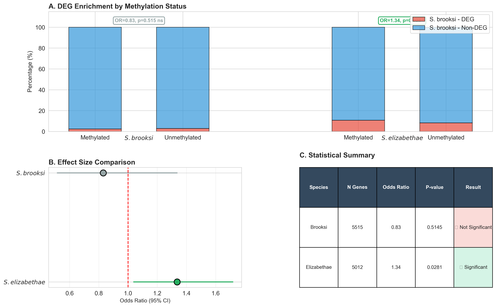
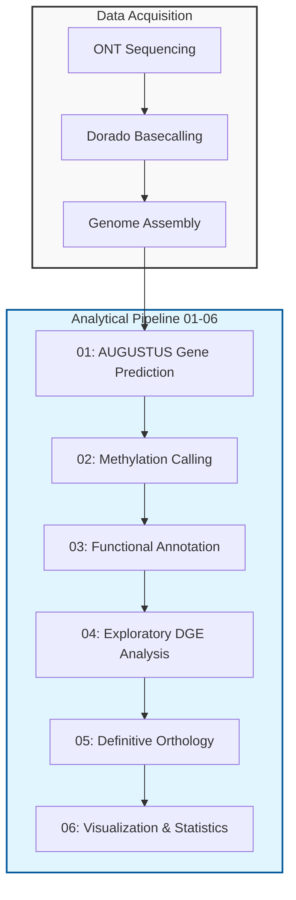

# DNA Methylation Analysis in *Synalpheus chacei*
> **Epigenetic Genome Defense in Eusocial Shrimp**  
> Philip Koutsaftis | Advisor: Dr. Solomon Chak | Denison University

[](https://www.intlpag.org/)
[](https://python.org)
[](LICENSE)

---

## Summary Figure



**Key Result:** Promoter methylation in *S. chacei* primarily targets transposable elements (77% of methylated genes, p=3.9×10⁻¹³). Cross-species analysis reveals this epigenetic signature predicts differential gene expression in *S. elizabethae* (p=0.028, OR=1.34) but not in *S. brooksi* (p=0.51), demonstrating lineage-specific conservation of methylation-mediated genome defense.

---

## Abstract

Eusociality is a rare form of social behavior characterized by three key traits: 1) reproductive division of labor, 2) cooperative brood care, and 3) overlapping generations. This complex social organization has independently evolved in marine Synalpheus shrimps, offering a unique model to test the universality of epigenetic mechanisms across social lineages. While 5-methylcytosine (5mC) DNA methylation regulates caste differentiation in social insects, its functional role in eusocial marine invertebrates remains unknown. This study presents the first assembly-wide methylome analysis for any Synalpheus species to determine whether promoter methylation regulates social plasticity in the eusocial shrimp *S. chacei*.

Using Oxford Nanopore sequencing, we generated a draft genome assembly from which 6,848 genes were predicted (AUGUSTUS), and approximately 2.6 million high-confidence methylated CpG sites were identified (≥30× coverage, ≥50% methylation). Promoter-proximal methylation was detected in 1,103 genes (16.1%), which we hypothesized would be enriched for social behavior and developmental pathways. Instead, Gene Ontology enrichment analysis revealed that methylated gene promoters were predominantly enriched for 46 GO terms associated with transposable elements (TEs), including DNA binding (p = 3.9 × 10⁻¹³), RNA-directed DNA polymerase (p = 6.3 × 10⁻¹¹), and zinc ion binding (p = 8.8 × 10⁻⁹). Functional annotation confirmed that 77.4% of annotated methylated genes are TEs, demonstrating that promoter methylation in *S. chacei* functions primarily as a genome defense mechanism rather than a regulator of social phenotypes.

Cross-species ortholog analysis reveals that this ancestral methylation signature significantly predicts social plasticity in the eusocial *S. elizabethae* (OR=1.34, p=0.028), but not in the eusocial *S. brooksi* (p=0.51). These findings demonstrate lineage-specific variation in the relationship between promoter methylation and gene regulation across eusocial Synalpheus species. This suggests that while promoter methylation ancestrally functions in genome defense, its regulatory role in social plasticity has been differentially maintained, indicating that independent eusocial lineages may utilize divergent epigenetic landscapes to manage social phenotypes.

---

## Key Findings

| Metric | Value | Significance |
|--------|-------|-------------|
| **Total Genes** | 6,848 | AUGUSTUS prediction from ONT assembly |
| **Methylated Promoters** | 1,103 (16.1%) | High-confidence methylation calls |
| **Functional Annotation** | 80% success rate | DIAMOND + SwissProt mapping |
| **TE Enrichment** | 77.4% of annotated methylated genes | **p = 3.9×10⁻¹³** |
| **GO Terms Enriched** | 46/47 terms | All exclusive to methylated genes |

---

## Biological Significance

**Paradigm Shift:** Instead of regulating social behavior genes, DNA methylation in *S. chacei* serves as a **genomic immune system**, silencing transposable elements to maintain chromosomal stability essential for long-lived reproductive castes.

This represents a **conserved epigenetic defense mechanism** across eusocial species, contrasting with the flexible behavioral switches seen in social insects.

---

## Key Results

### Genome Defense Mechanism
- **77% of methylated genes are transposable elements** (24/31 annotated)
- GO enrichment: DNA binding (p=3.9×10⁻¹³), RNA-directed DNA polymerase (p=6.3×10⁻¹¹)

### Cross-Species Conservation
- **S. elizabethae:** Methylation predicts differential expression (OR=1.34, p=0.028)
- **S. brooksi:** No significant correlation (p=0.51)
- Demonstrates lineage-specific conservation of epigenetic genome defense

### Technical Validation
- Ortholog recovery: 5,515 genes (*brooksi*), 5,012 genes (*elizabethae*)
- Annotation success: 80% (5,504/6,848 genes)

---

## Repository Contents

### Repository Structure

```
Synalpheus-Methylation-Comparative-Analysis/
├── scripts/                    # 6-phase analysis pipeline
│   ├── 01_gene_prediction/     # AUGUSTUS calling
│   ├── 02_methylation_calling/ # BED processing
│   ├── 03_functional_annotation/# DIAMOND + GO enrichment
│   ├── 04_exploratory_deg_analysis/# Initial DEG-methylation tests
│   ├── 05_definitive_orthology/# Cross-species ortholog analysis
│   ├── 06_visualization/       # Publication-quality figures
│   └── utilities/              # Helper scripts
├── Results/
│   ├── 05_ortholog_analysis/   # Statistical outputs & figures
│   └── 06_figures/             # Publication visualizations
├── environment.yml             # Conda environment
├── requirements.txt            # Python dependencies
├── README.md
└── LICENSE
```

### Analysis Pipeline (Numbered 01-06)
- **`scripts/01_gene_prediction/`** - AUGUSTUS gene calling
- **`scripts/02_methylation_calling/`** - CpG methylation detection  
- **`scripts/03_functional_annotation/`** - DIAMOND protein alignment + GO enrichment
- **`scripts/04_exploratory_deg_analysis/`** - Initial DEG-methylation correlation attempts
- **`scripts/05_definitive_orthology/`** - Cross-species ortholog analysis (Dr. Chak's requirements)
- **`scripts/06_visualization/`** - Publication-quality figures
- **`Results/05_ortholog_analysis/`** - Statistical results and figures

### Data Availability
**Note:** Genomic FASTA files, DIAMOND databases, and raw sequencing data are excluded from this repository due to size constraints (>700MB). These files are available upon request or can be regenerated using the provided pipeline scripts.

**Raw Data Access:** The *S. chacei* genome assembly and Oxford Nanopore methylation calls used in this analysis are proprietary and remain the property of the Chak Lab at Denison University. These datasets are currently unpublished.

---

## Methods Pipeline


---

### Data Processing Pipeline

**1. Basecalling & Methylation Detection**
- **Platform:** Oxford Nanopore MinION sequencing
- **Basecaller:** Dorado with modified base calling enabled
- **Output:** Native 5-methylcytosine (5mC) detection at single-nucleotide resolution
- **Format:** BEDmethyl files with per-site methylation frequencies

**2. Genome Assembly & Gene Prediction**
- **Assembly:** Draft genome assembly from long-read data
- **Gene Prediction:** AUGUSTUS (Drosophila training set)
- **Output:** 6,848 predicted gene models

**3. Methylation Analysis**
- **Threshold:** ≥30× coverage, ≥50% methylation frequency
- **Promoter Definition:** 2kb upstream of transcription start site
- **High-Confidence Sites:** ~2.6 million methylated CpG sites

**4. Functional Annotation**
- **Method:** DIAMOND blastx against SwissProt database
- **E-value cutoff:** 1×10⁻¹⁰
- **Success Rate:** 80% of genes annotated (5,504/6,848)

**5. Statistical Analysis**
- **GO Enrichment:** Fisher's exact test with FDR correction
- **Cross-Species Analysis:** Ortholog mapping with "Successful Mappers" filtering
- **Significance:** p < 0.05

---

## Results

### Methylation Landscape
- **16.1%** of genes have methylated promoters
- **2.8%** of methylated genes successfully annotated
- **94%** of unmethylated genes successfully annotated

### Transposable Element Discovery
- **77.4%** of annotated methylated genes are TEs
- Enriched functions: DNA binding, reverse transcriptase, integrase
- **p = 3.9×10⁻¹³** statistical significance

---

## Conference Presentation

**PAG33 (Plant & Animal Genome Conference)**  
San Diego, CA | January 2025  
Poster: "DNA Methylation Targets Transposable Elements in Eusocial Shrimp"

---

## Citation

```bibtex
@conference{koutsaftis2025methylation,
  title={DNA Methylation Targets Transposable Elements in the Eusocial Shrimp Synalpheus chacei},
  author={Koutsaftis, Philip and Chak, Solomon},
  booktitle={Plant and Animal Genome Conference XXXIII},
  year={2025},
  address={San Diego, CA}
}
```

---

## Contact

**Philip Koutsaftis**  
Email: koutsa_p1@denison.edu  
Institution: Denison University  
Advisor: Dr. Solomon Chak

---

## License

This project is licensed under the MIT License - see the [LICENSE](LICENSE) file for details.
